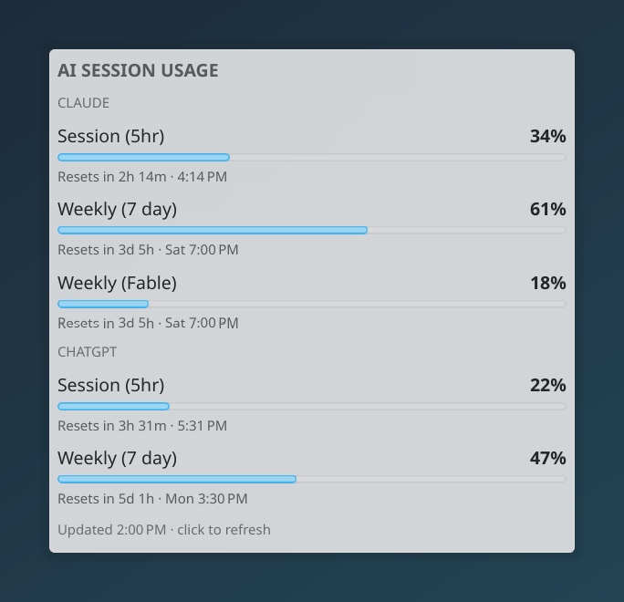
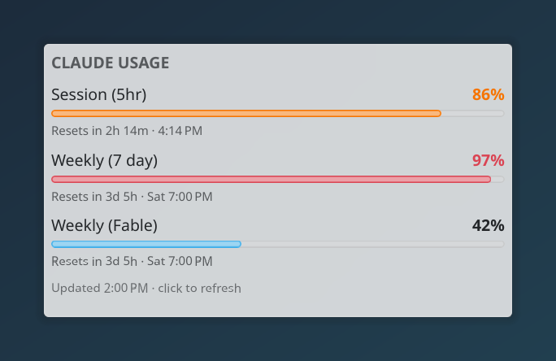

# ai-session-usage

A KDE Plasma 6 widget showing your Claude Code and ChatGPT (Codex) subscription limits: session, weekly and per-model caps, with reset countdowns.



## Install

Download the `.plasmoid` and its `.sha256` file from the [latest release](https://github.com/chaybits/ai-session-usage/releases/latest), then, in the folder you saved them to:

```
sha256sum -c ai-session-usage-*.plasmoid.sha256
kpackagetool6 --type Plasma/Applet --install ai-session-usage-*.plasmoid
```

Requires KDE Plasma 6, Python 3.9 or newer as `python3` on the `PATH`, and at least one of: Claude Code installed and logged in with a Claude subscription, or the Codex CLI installed and logged in with a ChatGPT account. Nothing else is installed; the helper uses the Python standard library only. To update, run the same command with `--upgrade` instead of `--install`.

From a clone, `python3 scripts/build_plasmoid.py` writes the same package to `dist/`, or install the folder directly with `kpackagetool6 --type Plasma/Applet --install src`. For development, link the folder instead, so an edit is live after `systemctl --user restart plasma-plasmashell.service`:

```
ln -s "$PWD/src" ~/.local/share/plasma/plasmoids/io.github.chaybits.aisessionusage
```

You should see **AI Session Usage** in **Add Widgets**.

**Windows:** the same card is a [Rainmeter](https://www.rainmeter.net/) skin. Download the `.rmskin` from the release and open it; Rainmeter's Skin Installer loads it. It needs Rainmeter 4.5 or newer and Python 3.9 or newer as `python` on the `PATH` (the installer from python.org with "Add to PATH" ticked, or `winget install Python.Python.3.12`), plus Claude Code and/or the Codex CLI installed and logged in. The skin's variables (`Manage`, the skin, `Variables`) hold the refresh interval, the colours, the Claude source and, when a tool is not on the `PATH`, its program. Right-click the skin for the project page. Placed on the desktop, it shows one row per limit; a provider you are not logged in to is left out.

For Claude, the widget by default asks Claude Code itself for its usage (it runs `claude` once per refresh, with no prompt), so it never touches your login. Claude Code must be installed and logged in. A lighter choice in the settings takes the numbers Claude Code passes to its status line instead (5-hour and weekly only); for that, add this to `~/.claude/settings.json` (the settings page shows the line with your path filled in):

```
"statusLine": {"type": "command", "command": "python3 -B ~/.local/share/plasma/plasmoids/io.github.chaybits.aisessionusage/contents/code/statusline_tap.py"}
```

Claude Code's status bar then shows "5h 34% · 7d 61%", and the widget fills in after Claude Code's next answer. If you already have a status line, keep it with `--then "<your command>"` at the end of that command.

## Usage

Each row is one limit: the percentage used, a bar, and when it resets ("Resets in 2h 3m · 14:05"; a weekday or a date when it is further away). With both providers logged in, the card has a Claude section and a ChatGPT section, each in the order the service reports its limits, until you choose another order (below).

- **Click** anywhere on the card to refresh (at most once every 10 seconds); it also refreshes every 5 minutes by itself.
- **Right-click** for the widget's menu (refresh now, configure, remove).
- **Order:** in the settings, rows can be moved up and down, also between the two services: put both 5-hour rows first, say. While each service's rows stay together the card keeps its sections; once they are mixed it is one list, and each row is named "Claude · Session (5hr)".
- **In a panel** the widget shows the first two percentages of each provider ("13% · 40% | 12% · 30%"), in your order; clicking opens the full card. The tooltip lists every row.
- **Colours:** a percentage turns orange at 80 % and red at 95 %. Numbers older than 15 minutes turn yellow, and a provider whose last refresh failed is dimmed with the reason underneath. All three colours can be changed.

Both 5-hour rows first (the services mixed), and Claude's rows in the order Fable, weekly, 5-hour:


A session at 86 % in orange and a weekly limit at 97 % in red:



## Configuration

Right-click the widget, **Configure AI Session Usage**:

| Page | Setting | Default |
|---|---|---|
| General | Refresh interval | 5 minutes |
| General | Show Claude Code limits; from Claude Code itself or its status line; Claude Code program; login file (only checked to exist) | on; Claude Code itself; `claude` on the PATH; `$CLAUDE_CONFIG_DIR/.credentials.json` or `~/.claude/.credentials.json` |
| General | Show ChatGPT (Codex) limits; Codex program; login file (only checked to exist) | on; `codex` on the PATH; `$CODEX_HOME/auth.json` or `~/.codex/auth.json` |
| Rows | Untick a row to hide it (for example a per-model cap); move rows up and down | all shown, each service's rows in its own order |
| Appearance | Size: fit to the widget's width (resize it to zoom), or a fixed zoom | fit to width |
| Appearance | When the rows do not fit: scroll, make the widget taller, or shrink the text | scroll |
| Appearance | Mark numbers as outdated after, and the outdated colour | 15 minutes, yellow |
| Appearance | Warning colour from, and the colour | 80 %, orange |
| Appearance | Critical colour from, and the colour | 95 %, red |

`CLAUDE_CONFIG_DIR` and `CODEX_HOME` are read from the environment Plasma runs in, not from your shell; if you set either in a shell profile only, enter the file in the settings instead.

## Privacy

The widget talks to no server. It asks the two command-line tools for their own usage, the way their own editor extensions do, and shows what they answer. Neither login file is read: each is only checked to exist, so that someone without that tool sees no section for it.

**Claude, from Claude Code itself (the default).** The widget runs `claude` headless with one request, the usage request Claude Code's own editor extension sends, and no prompt: hooks off, no MCP server, nothing saved as a session. Claude Code asks Anthropic with its own login and answers with the limits.

**Claude, from the status line.** Claude Code runs `contents/code/statusline_tap.py` as its status line and hands it a description of the session. The script keeps only the usage windows in it (percentages and reset times) and the time it saw them, in `~/.cache/ai-session-usage/claude-statusline.json`; nothing else of the session is written. The widget reads that file. No request is made.

**ChatGPT, from Codex itself.** The widget runs `codex app-server`, the protocol Codex's own editor extension speaks, and sends one request, `account/rateLimits/read`: the numbers Codex's `/status` shows. Codex asks OpenAI with its own login and answers; the widget closes the connection and Codex exits.

The helper writes nothing to disk except the status-line file above, and prints no token in any output, error or log: it never holds one.

This is not an official Anthropic or OpenAI product. Both requests are ones the tools' makers mark experimental or document only for their own clients, and they can change without notice. The services' terms: Anthropic's [Claude Code legal and compliance](https://code.claude.com/docs/en/legal-and-compliance) and OpenAI's [Terms of Use](https://openai.com/policies/terms-of-use/). Either provider can be turned off in the settings.

## Known limitations

- Both tools are asked over requests their makers mark experimental; if one changes, that section shows "Unexpected answer" until the widget is updated. Each refresh starts Claude Code for about two seconds and Codex for under a second.
- From Claude Code's status line, the numbers are as fresh as Claude Code's last answer: with no session running they stay as they were, shown with the time they were seen. The status line carries the 5-hour and weekly limits only; per-model caps (such as a weekly cap for one model) need the default source, Claude Code itself.
- KDE Plasma 6 on Linux only. (On macOS Claude Code keeps its login in the Keychain, so the widget's check for a login file would find none.)
- Subscription logins only: an API-key login has no subscription limits to show.
- For ChatGPT, the rows are the limits Codex reports (on Plus, the 5-hour and weekly limits are shared with ChatGPT Work). The message caps of ordinary ChatGPT chat are not in that answer, so they are not shown.
- Usage made elsewhere (claude.ai, the ChatGPT apps) counts against the same limits but appears only at the next refresh.
- English only.

## License

GPL-3.0-or-later (see [`LICENSE`](LICENSE)).
