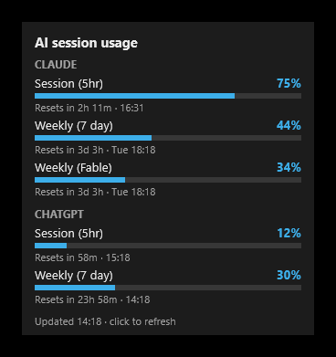
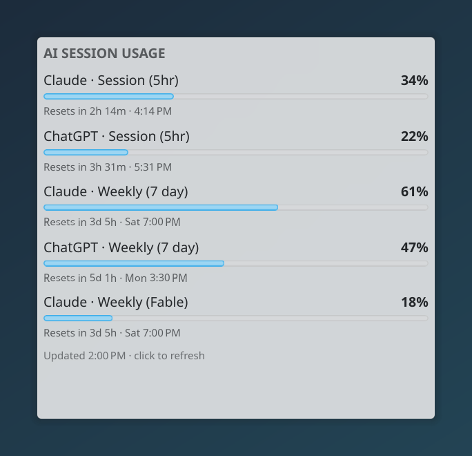
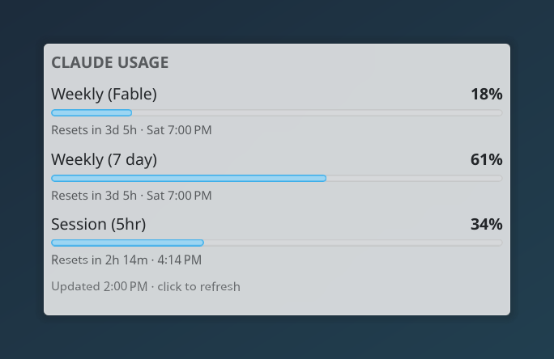

# ai-session-usage

[English](README.md) | Türkçe

Claude Code ve ChatGPT (Codex) abonelik limitlerinizi sıfırlanma zamanlarıyla birlikte gösteren bir KDE Plasma 6 bileşeni (widget) ve bir Windows Rainmeter skin'i.


## Kurulum

Gerekenler:

- `PATH` üzerinde Python 3.9 veya üstü (Linux'ta `python3`, Windows'ta `python` adıyla).
- Claude aboneliğiyle giriş yapılmış Claude Code, ya da ChatGPT hesabıyla giriş yapılmış Codex CLI. Biri yeter; giriş yapılmamış sağlayıcı gösterilmez.

Ek bağımlılık yok: yardımcı program yalnızca Python standart kütüphanesini kullanır.

### KDE Plasma 6 (Linux)

KDE Plasma 6 gerekir. `.plasmoid` dosyasını ve `.sha256` dosyasını [son sürümden](https://github.com/chaybits/ai-session-usage/releases/latest) indirin, sonra dosyaları kaydettiğiniz klasörde şunları çalıştırın (`*` işareti, klasörde yalnızca bir paketin indirildiğini varsayar):

```
sha256sum -c ai-session-usage-*.plasmoid.sha256
kpackagetool6 --type Plasma/Applet --install ai-session-usage-*.plasmoid
```

İlk satır dosyanın adını ve ardından `OK` çıktısını verir. **AI Session Usage** artık bileşen listesinde görünür (masaüstünün ya da bir panelin sağ tık menüsündeki **Add or Manage Widgets…**, Türkçe Plasma'da **Araç Takımları Ekle veya Yönet…**): masaüstüne ya da bir panele ekleyin. Güncellemek için aynı komutu `--install` yerine `--upgrade` ile çalıştırın; kaldırmak için `kpackagetool6 --type Plasma/Applet --remove io.github.chaybits.aisessionusage`.

Bileşen varsayılan olarak kullanım bilgisini Claude Code'un kendisinden ister; daha hafif kaynak olan Claude Code durum satırı, ayarlardaki **From:** seçeneğinden seçilir (aşağıda [Claude kaynağı](#claude-kaynağı)).

### Windows (Rainmeter)

[Rainmeter](https://www.rainmeter.net/) 4.5 veya üstü gerekir. Ayrıca `PATH` üzerinde `python` adıyla Python 3.9 veya üstü bulunmalıdır: python.org'daki kurulum programını "Add to PATH" işaretli olarak çalıştırın ya da `winget install Python.Python.3.12` komutunu kullanın. Microsoft Store'u açan bir `python` komutu, kurulu Python anlamına gelmez. `.rmskin` ve `.sha256` dosyalarını [son sürümden](https://github.com/chaybits/ai-session-usage/releases/latest) indirin. PowerShell'de, dosyaları kaydettiğiniz klasörde şu komutu çalıştırın; dosya sağlamsa `True` yazar, `False` yazarsa dosyaları yeniden indirin:

```
(Get-FileHash ai-session-usage-*.rmskin).Hash -eq (Get-Content ai-session-usage-*.rmskin.sha256).Split()[0]
```

Sonra `.rmskin` dosyasını açın: Rainmeter'ın **Skin Installer** penceresi paketi (ad: ai-session-usage, yazar: chaybits) gösterir; **Install** (yükle) düğmesi kartı masaüstüne yerleştirir. Kart görünmezse Rainmeter'ın **Manage** (yönet) penceresinden yükleyin.



### Kaynaktan

Depoyu klonladıysanız `python3 scripts/build_plasmoid.py` aynı `.plasmoid` paketini `dist/` içine yazar; ya da `src` klasörünü doğrudan `kpackagetool6 --type Plasma/Applet --install src` ile kurun. Geliştirme için `src` klasörünü sembolik bağlantıyla (symlink) bağlayın; böylece değişiklikler `systemctl --user restart plasma-plasmashell.service` sonrasında hemen geçerli olur:

```
ln -s "$PWD/src" ~/.local/share/plasma/plasmoids/io.github.chaybits.aisessionusage
```

Windows'ta `python scripts/build_rmskin.py` aynı `.rmskin` paketini `dist/` içine yazar.

## Kullanım

Her satır bir limittir: kullanılan yüzde, bir çubuk ve ne zaman sıfırlanacağı ("Resets in 2h 3m · 14:05"; daha uzaksa bir gün adı ya da tarih). Etiketler servislerin kendi etiketleridir: "Session (5hr)", "Weekly (7 day)" ve planınızda varsa "Weekly (Fable)" gibi modele özel haftalık bir limit. İki sağlayıcıya da giriş yapılmışsa kartta bir Claude bölümü ve bir ChatGPT bölümü bulunur; her biri, siz başka bir sıra seçene dek (aşağıda Sıra maddesi), servisin bildirdiği sıradadır.

- Yenilemek için kartın herhangi bir yerine **tıklayın** (en fazla 10 saniyede bir); kart varsayılan olarak 5 dakikada bir kendiliğinden de yenilenir (ayarlarda **Refresh every (minutes)**). Her yenileme iki aracı da başlatır (Claude Code yaklaşık iki saniye, Codex bir saniyeden az); bu kısa süreliğine işlemci ve ağ kullanır.
- Bileşenin menüsü için **sağ tıklayın** (şimdi yenile, yapılandır, kaldır).
- **Sıra:** ayarlardaki **Rows** sayfasında satırlar yukarı ve aşağı taşınabilir, iki servis arasında da: örneğin iki oturum satırını en üste koyun. Her servisin satırları bir arada kaldıkça kart bölümlerini korur; karıştıklarında tek bir liste olur ve her satır "Claude · Session (5hr)" gibi adlandırılır.
- **Panelde** bileşen, her sağlayıcının ilk iki yüzdesini seçtiğiniz sırayla gösterir: Claude | ChatGPT ("13% · 40% | 12% · 30%"). Tıklayınca tam kart açılır; fare imlecini üzerine getirince araç ipucu her satırı listeler.
- **Renkler:** bir yüzde %80'de turuncuya, %95'te kırmızıya döner. 15 dakikadan eski sayılar sarıya döner; son yenilemesi başarısız olan sağlayıcının satırları soluklaştırılır ve altına nedeni yazılır. Üç renk de değiştirilebilir.

İki oturum satırı en üstte, servisler karışık:



Claude'un satırları Weekly (Fable), Weekly (7 day), Session (5hr) sırasına alınmış:



%86'daki bir oturum turuncu, %97'deki bir haftalık limit kırmızı:


Windows'ta yenilemek için skin'e tıklayın; 5 dakikada bir kendiliğinden de yenilenir. Satır sırası, panel biçimi ve ayar sayfaları yalnızca Plasma bileşeninde vardır; skin'in ayarları değişkenleridir (bkz. Yapılandırma).

## Yapılandırma

Bileşene sağ tıklayın, **Configure AI Session Usage…** (Türkçe Plasma'da **Yapılandır: AI Session Usage…**). Ayar sayfalarındaki etiketler İngilizcedir; tabloda her birinin Türkçe açıklaması yanında verilmiştir:

| Sayfa | Ayar | Varsayılan |
|---|---|---|
| General | Refresh every (minutes): yenileme aralığı | 5 |
| General | Claude Code: Show the Claude Code limits (Claude Code limitlerini göster) | açık |
| General | Claude Code: From (kaynak) | Claude Code itself (Claude Code'un kendisi); ya da Claude Code's status line (durum satırı) |
| General | Claude Code program (programı) | `PATH` üzerinde bulunan `claude` |
| General | Claude Code: Login file (giriş dosyası; yalnızca var olup olmadığına bakılır) | `$CLAUDE_CONFIG_DIR/.credentials.json` ya da `~/.claude/.credentials.json` |
| General | ChatGPT (Codex): Show the ChatGPT (Codex) limits (ChatGPT limitlerini göster) | açık |
| General | Codex program (programı) | `PATH` üzerinde bulunan `codex` |
| General | ChatGPT (Codex): Login file (giriş dosyası; yalnızca var olup olmadığına bakılır) | `$CODEX_HOME/auth.json` ya da `~/.codex/auth.json` |
| Rows | Gizlemek için satırın işaretini kaldırın (örneğin modele özel bir limit); oklar satırı taşır; **Default order** (varsayılan sıra) sırayı sıfırlar | hepsi gösterilir, her servisin satırları kendi sırasında |
| Appearance | Size (boyut) | Fit to the widget's width (bileşenin genişliğine sığdırma; yakınlaştırmak için yeniden boyutlandırın); ya da Fixed zoom (sabit yakınlaştırma) |
| Appearance | When the rows do not fit (satırlar sığmadığında) | Scroll (kaydırma); ya da Make the widget taller (bileşeni uzatma), Shrink the text to fit (yazıyı küçültme) |
| Appearance | Mark numbers as outdated after (sayıların bu süreden sonra güncelliğini yitirmiş sayılması); Outdated colour (güncelliğini yitirmiş sayıların rengi) | 15 dakika; sarı |
| Appearance | Warning colour from (uyarı renginin başladığı yüzde); Warning colour (uyarı rengi) | %80; turuncu |
| Appearance | Critical colour from (kritik rengin başladığı yüzde); Critical colour (kritik renk) | %95; kırmızı |

İki giriş dosyası alanındaki yol yalnızca dosyanın var olup olmadığını denetlemek için kullanılır; dosyalar hiç okunmaz. `CLAUDE_CONFIG_DIR` ve `CODEX_HOME` kabuğunuzdan değil, Plasma'nın çalıştığı ortamdan okunur; birini yalnızca kabuk profilinde ayarladıysanız ilgili dosya yolunu ayarlardan belirtin.

### Claude kaynağı

Bileşen varsayılan olarak kullanım bilgisini Claude Code'un kendisinden ister: her yenilemede `claude` programını bir kez, istem (prompt) olmadan çalıştırır; böylece girişinize hiç dokunmaz ve Claude Code'un bildiği her limit, modele özel olanlar dahil, gösterilir. Claude Code kurulu ve giriş yapılmış olmalıdır.

Daha hafif seçenek, Claude Code'un durum satırına ilettiği sayıları alır (yalnızca 5 saatlik ve haftalık; Claude Code'un son yanıtı kadar taze). **Claude Code** altında **From:** seçeneğini **Claude Code's status line** olarak ayarlayın, sonra `~/.claude/settings.json` dosyasına `statusLine` girdisini ekleyin (ayar sayfası bu girdiyi, yol sizin kurulumunuza göre doldurulmuş olarak gösterir):

```json
{"statusLine": {"type": "command", "command": "python3 -B ~/.local/share/plasma/plasmoids/io.github.chaybits.aisessionusage/contents/code/statusline_tap.py"}}
```

Dosyada zaten başka anahtarlar varsa yalnızca `statusLine` girdisini mevcut süslü parantezlerin içine ekleyin; ikinci bir `statusLine` anahtarı eklemeyin. Bundan sonra Claude Code'un durum satırında "5h 34% · 7d 61%" görünür; bileşen, Claude Code'un bir sonraki yanıtından sonra bu sayıları göstermeye başlar. Zaten bir durum satırınız varsa komutunuzu sona ekleyerek koruyun:

```
python3 -B ~/.local/share/plasma/plasmoids/io.github.chaybits.aisessionusage/contents/code/statusline_tap.py --then "<komutunuz>"
```

### Windows

Windows'ta ayarlar skin'in değişkenleridir: Rainmeter'ın **Manage** (yönet) penceresinde skin'i seçin, **Edit** (düzenle) düğmesine tıklayın, bir değeri değiştirin, kaydedin ve **Refresh** (yenile) düğmesine tıklayın. Değişkenler: `RefreshMinutes` (5), `ShowClaude` ve `ShowCodex` (1; gizlemek için 0), `ClaudeSource` (`claudecode` ya da `statusline`), `ClaudeProgram` ve `CodexProgram` (boş: `PATH` üzerinde aranır), `WarnPercent` (80), `CriticalPercent` (95), `StaleMinutes` (15) ve renkler. Durum satırı kaynağı için aynı `statusLine` girdisi `%USERPROFILE%\.claude\settings.json` dosyasına, betiğin skin'deki kopyasını gösterecek biçimde eklenir: `Documents\Rainmeter\Skins\AiSessionUsage\@Resources\code\statusline_tap.py` (JSON içinde her ters eğik çizgiyi iki kez yazın); sayılar `%LOCALAPPDATA%\ai-session-usage\claude-statusline.json` dosyasında tutulur.

## Gizlilik

Bileşen kendi adına hiçbir bağlantı açmaz. Çalıştırdığı iki komut satırı aracı, her biri kendi girişiyle, kendi servisine bağlanır. Hiçbir giriş dosyası okunmaz; her birinin yalnızca var olup olmadığına bakılır, böylece o aracı olmayan biri onun bölümünü görmez. Durum satırı kipinde yalnızca yüzdeleri ve sıfırlanma zamanlarını tutan tek bir önbellek dosyası yazılır. Bir yenileme istem göndermez ve konuşma açmaz; dolayısıyla gösterdiği limitlerden hiçbirini harcamaz. Windows skin'i aynı yardımcı programı çalıştırır; bu güvenceler orada da geçerlidir.

### Her kaynak nasıl çalışır

**Claude, Claude Code'un kendisinden (varsayılan).** Bileşen `claude` programını headless kipte (arayüzsüz), kullanım bilgisini isteyen tek bir istekle ve istem göndermeden çalıştırır; kancalar (hooks) ve MCP sunucuları kapalıdır, oturum kaydedilmez. Claude Code kendi girişiyle Anthropic'e sorar ve limitleri yanıt olarak döndürür.

**Claude, durum satırından.** Claude Code `statusline_tap.py` betiğini durum satırı olarak çalıştırır ve ona oturumun bir açıklamasını (JSON) iletir. Betik bunun içinden yalnızca kullanım pencerelerini (yüzdeler ve sıfırlanma zamanları) ve onları gördüğü zamanı `~/.cache/ai-session-usage/claude-statusline.json` dosyasında tutar; oturumun diğer hiçbir verisi yazılmaz. Bileşen o dosyayı okur. Hiçbir istek yapılmaz.

**ChatGPT, Codex'in kendisinden.** Bileşen `codex app-server` çalıştırır ve tek bir istek gönderir, `account/rateLimits/read`: Codex'in `/status` komutunun gösterdiği sayılar. Codex kendi girişiyle OpenAI'ye sorar ve yanıtı döndürür; bileşen bağlantıyı kapatır, Codex da sonlanır.

Yardımcı program `src/contents/code/` altındadır ve yalnızca Python standart kütüphanesini kullanır; isteyen okuyabilir. Yukarıdaki durum satırı dosyası dışında diske hiçbir şey yazmaz ve hiçbir çıktıda, hatada ya da günlükte token yazdırmaz: hiçbir zaman bir token'a erişmez.

Bu proje Anthropic ya da OpenAI'nin resmi bir ürünü değildir. İlgili servislerin kullanım koşulları: Anthropic'in [Claude Code legal and compliance](https://code.claude.com/docs/en/legal-and-compliance) sayfası ve OpenAI'nin [Terms of Use](https://openai.com/policies/terms-of-use/) sayfası. İki sağlayıcı da ayarlardan kapatılabilir.

## Bilinen sınırlamalar

- Bileşen her iki araçtan da, geliştiricilerinin deneysel saydığı ya da yalnızca kendi istemcileri (client) için belgelediği istekler yoluyla veri alır; biri değişirse ilgili bölüm, bileşen güncellenene kadar "Unexpected answer" (beklenmeyen yanıt) gösterir.
- Claude Code'un durum satırından alınan sayılar Claude Code'un son yanıtı kadar tazedir: çalışan bir oturum yokken oldukları gibi kalır ve görüldükleri zamanla birlikte gösterilir; sıfırlanma zamanı geçmiş bir pencere, Claude Code onu yeniden bildirene dek %0 gösterir. Durum satırı yalnızca 5 saatlik ve haftalık limitleri taşır; modele özel limitler için varsayılan kaynak olan Claude Code'un kendisi gerekir.
- Desteklenen platformlar: Linux'ta KDE Plasma 6, Windows'ta Rainmeter. macOS desteklenmez: orada Claude Code girişi Anahtar Zinciri'nde (Keychain) tuttuğu için giriş dosyası denetimi hiçbir şey bulamaz.
- Windows'ta skin saatleri bölgesel ayarlardan bağımsız olarak 24 saatlik biçimde gösterir; satır sırası, panel biçimi ve ayar sayfaları yoktur: bunlar Plasma bileşenine özgüdür.
- Yalnızca abonelik girişleri desteklenir: API anahtarıyla yapılan girişin gösterilecek abonelik limiti yoktur.
- ChatGPT için satırlar, giriş yapılmış Codex CLI'nin bildirdiği limitlerdir; sıradan ChatGPT sohbetinin mesaj sınırları bunların arasında değildir.
- Başka yerde yapılan kullanım (claude.ai, ChatGPT uygulamaları) aynı limitlerden düşer, ancak bir sonraki yenilemede görünür: en geç bir yenileme aralığı sonra, ya da tıklayarak hemen.
- Arayüz yalnızca İngilizcedir.

## Lisans

GPL-3.0-or-later (bkz. [`LICENSE`](LICENSE)).
